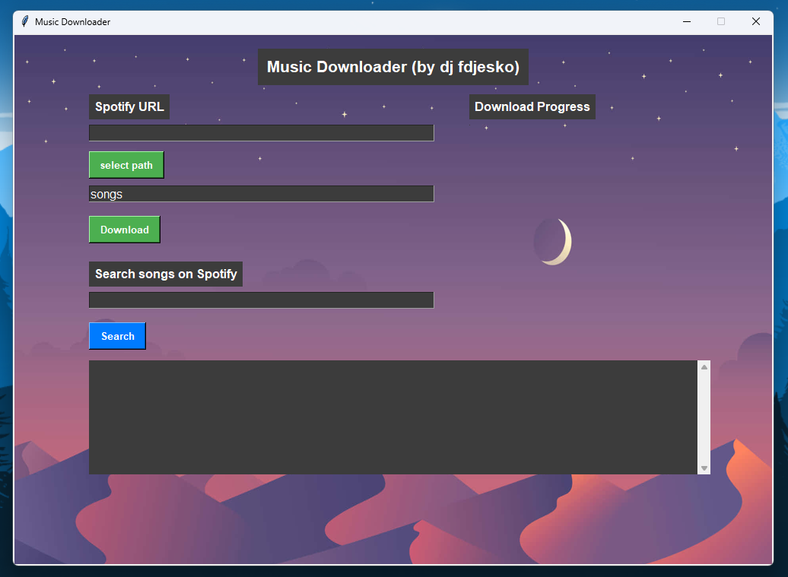

# Music Downloader

## Overview

This is a simple application that allows you to download music from a Spotify playlist using `yt-dlp`.



## Prerequisites

- FFmpeg:
  - Download FFmpeg from the [official site](https://ffmpeg.org/download.html).
  - Follow these steps to set up FFmpeg on your system:
    - Windows: Add the extracted FFmpeg folder (e.g., `C:\ffmpeg\bin`) to your system's PATH environment variable
    - macOS/Linux: Install FFmpeg using Homebrew or download and configure it manually:
      ```bash
      brew install ffmpeg
      ```
  - Verify the installation by running:
    ```bash
    ffmpeg -version
    ```
  - Ensure FFmpeg is accessible globally
- Python **(if using the source code)**:
  - Make sure Python 3.8 or higher is installed on your system. You can download it from [python.org](https://www.python.org/).

## Installation

1. If using the executable, just open the file `Music Downloader.exe`
2. If using the source code:
   1. Clone the Repository:
      ```
      git clone https://github.com/daniel1181888/Music-downloader.git
      cd Music-downloader
      ```
   2. Install Python Dependencies:
      ```
      pip install -r requirements.txt
      ```

## Usage

1. Running the Application
   1. If using the executable, just open the file `Music Downloader.exe`
   2. If using the source code:
      ```bash
      python main.py
      ```
      You will be prompted to enter your Spotify API credentials. \
      Do as instructed in the GUI.
2. Using the Application:
   - Enter a Spotify playlist URL or track URL.
   - Click the "Download" button to start downloading tracks.

## Limitations

- The application does not work for private playlists yet.

## Building the application (for developers)

1. Open `auto-py-to-exe`
   ```bash
   auto-py-to-exe
   ```
2. Open "Settings"
3. Click "Import Config From JSON File"
4. Select `auto-py-to-exe.json`
5. Click "CONVERT .PY TO .EXE"

## Formatting (for developers)

```bash
black .
```
